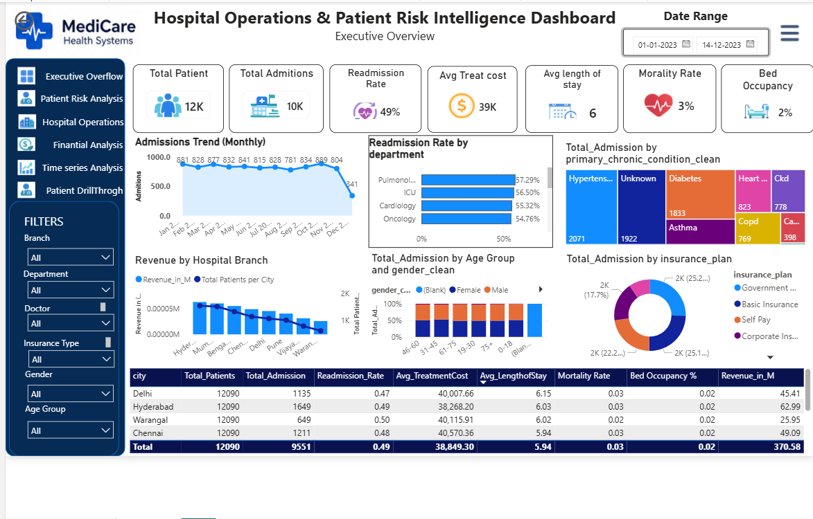

# 🏥 Hospital Operations & Patient Risk Intelligence Dashboard

A comprehensive **Power BI Dashboard** developed to monitor hospital operations, patient risks, financial performance, and healthcare KPIs. This project provides interactive insights for healthcare administrators and executives to support data-driven decision-making.

---

# 📌 Project Overview

The **Hospital Operations & Patient Risk Intelligence Dashboard** enables hospitals to analyze:

- Patient admissions and readmissions
- Department performance
- Revenue generation
- Bed occupancy rates
- Mortality statistics
- Treatment costs
- Insurance plan distribution
- Patient demographics
- Chronic condition trends

The dashboard offers a centralized executive overview for operational monitoring and strategic planning.

---

# 📷 Dashboard Preview



---

# 🚀 Features

## ✅ Executive Overview
- Total Patients
- Total Admissions
- Readmission Rate
- Average Treatment Cost
- Average Length of Stay
- Mortality Rate
- Bed Occupancy Percentage

## 📊 Analytical Visualizations
- Monthly Admissions Trend
- Readmission Rate by Department
- Revenue by Hospital Branch
- Age & Gender Distribution
- Insurance Plan Analysis
- Chronic Condition Analysis

## 🎛️ Interactive Filters
Users can dynamically filter reports by:
- Branch
- Department
- Doctor
- Insurance Type
- Gender
- Age Group
- Date Range

---

# 🛠️ Technologies Used

- **Power BI Desktop**
- **DAX (Data Analysis Expressions)**
- **Power Query**
- **CSV Datasets**
- Data Modeling
- Interactive Visualizations

---

# 📂 Dataset Files

The project includes the following datasets:

```bash
accounts.csv
customers.csv
loan_payments.csv
support_tickets.csv
transactions.csv
